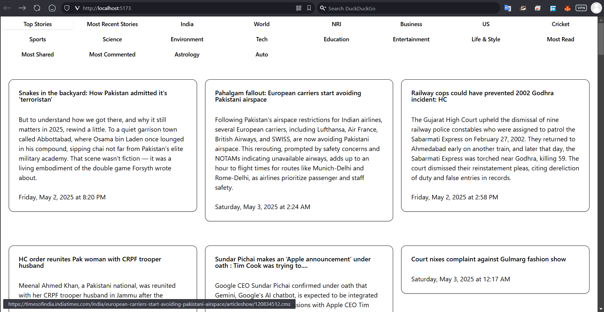
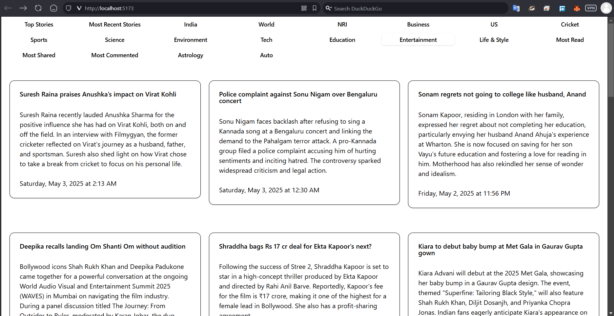
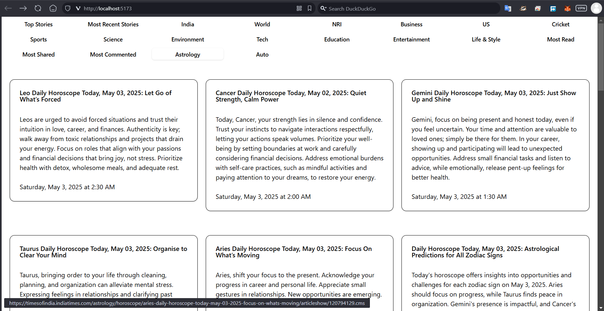

# Block Intelligence Assignment

This project is a full-stack application that fetches and displays RSS news feeds. It consists of a **Frontend** built with React and Vite, and a **Backend** built with Express.js. The application allows users to browse news articles categorized into various topics.

# Screenshots:

